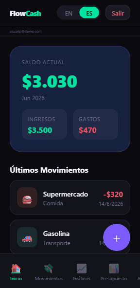

# FlowCash

App móvil de finanzas personales construida con React Native + Expo. Permite registrar ingresos y gastos, armar presupuestos, fijar metas de ahorro, ver gráficos de gastos por categoría, y **auto-completar transacciones parseando automáticamente los emails de confirmación de Mercado Pago** vía Gmail.



## Stack

- React Native (Expo SDK 55) + React 19
- Firebase (Auth + Firestore) para persistencia y sincronización
- Gmail API (OAuth) para leer y parsear comprobantes de Mercado Pago
- `expo-notifications` para recordatorios de pago
- Soporte web y móvil (Android/iOS) desde el mismo código

## Pantallas

Dashboard, Transacciones, Gráficos, Presupuesto, Ahorros, Mercado Pago (auto-import), Recordatorios.

## Setup

```bash
npm install
cp .env.example .env   # completar credenciales Firebase + Google OAuth
npm start
```

Variables requeridas en `.env`:

| Variable | Uso |
|---|---|
| `FIREBASE_API_KEY`, `FIREBASE_AUTH_DOMAIN`, `FIREBASE_PROJECT_ID`, `FIREBASE_STORAGE_BUCKET`, `FIREBASE_MESSAGING_SENDER_ID`, `FIREBASE_APP_ID` | Config de Firebase (Auth + Firestore) |
| `GOOGLE_WEB_CLIENT_ID`, `GOOGLE_ANDROID_CLIENT_ID` | Login con Google + acceso de lectura a Gmail para el parseo de Mercado Pago |

También se necesita `google-services.json` en la raíz para el build de Android (no se versiona, ver `.gitignore`).

## Scripts

```bash
npm start       # expo start
npm run android # expo run:android
npm run ios     # expo run:ios
npm run web     # expo start --web
npm run lint    # eslint (eslint-config-expo)
npm test        # jest (jest-expo)
```

## Build

APK de release generado con EAS (`eas.json`). Build actual disponible en `flowcash-release.apk` en la raíz del proyecto.
